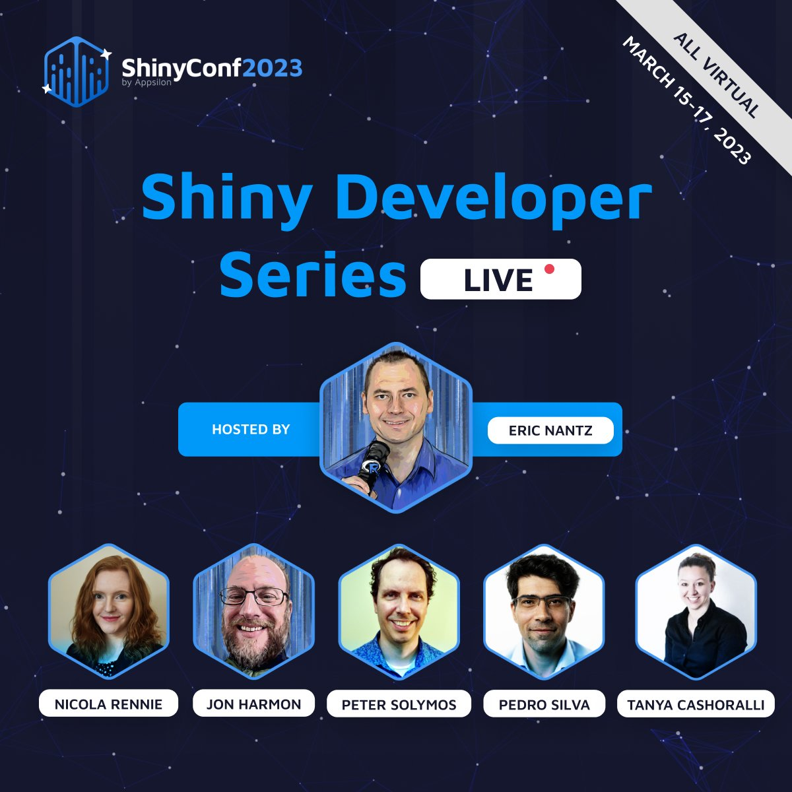

The Shiny Developer Series will be recording live at #ShinyConf2023! Hosted by Eric Nantz, together with panellists Tanya Cashorali, Jon Harmon, Pedro Coutinho Silva, Péter Sólymos, and Nicola Rennie, he'll discuss recent innovations in Shiny and more.

